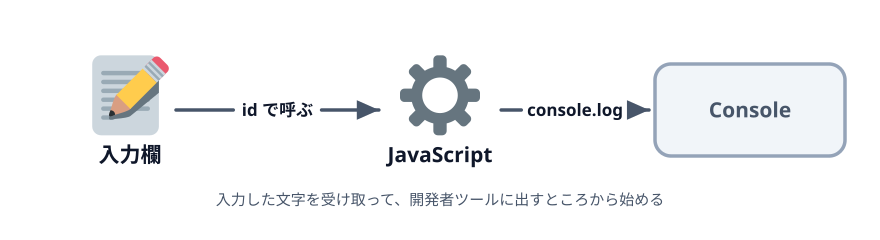
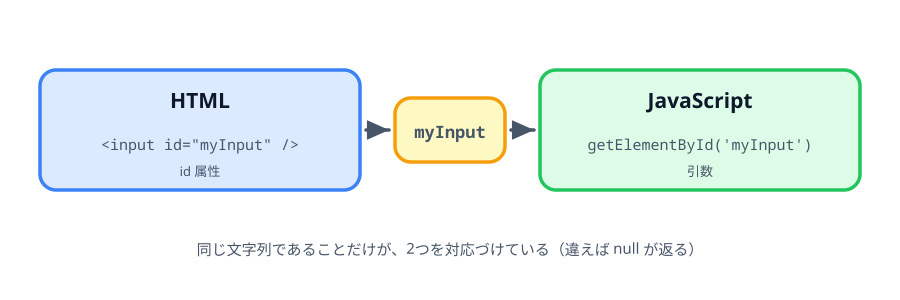
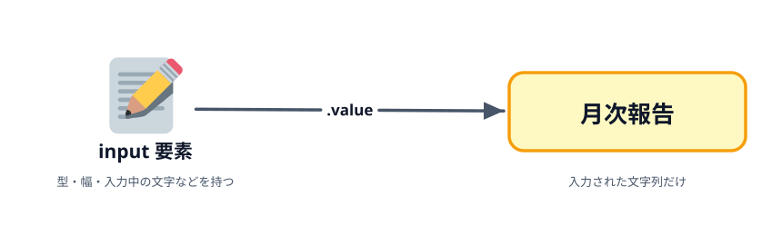

# 1-1 入力した値を取り出す



まっさらな `index.html` を1枚作り、入力欄を1つ置きます。そこに書いた文字を JavaScript で
受け取って、開発者ツールの Console に出すところまでをやります。

## この節で作るもの

::preview[この節の完成形（新しいタブで開いて F12 を押してください）]{height="300"}

入力欄が1つあるだけのページです。画面には何も起きません。
`F12` で開発者ツールを開き、**Console** タブに `月次報告` と出ていれば、
入力欄の値が JavaScript から取れたということです。

このあとの節で画面に出し、URL を組み立てていきますが、まずは
「HTML に置いた入力欄の値を JavaScript から取れる」ことだけを確かめます。

> **今回さわるファイル:** `index.html` を新しく作る

## ファイルを1枚作る

サクラエディタを開いて、**ファイル → 名前を付けて保存** を選びます。

- ファイル名: `index.html`
- 文字コードセット: **UTF-8**
- 保存場所: どこでもよいので、自分で分かるフォルダを1つ作る（例: デスクトップに `url-generator`）

:::warning
「ファイルの種類」が「テキストファイル (\*.txt)」のままだと `index.html.txt` で保存されます。
種類を「すべてのファイル」にしてから、ファイル名を `index.html` と入力してください。

文字コードが `SJIS` のままだと、ブラウザで開いたときに日本語が文字化けします。
画面下の表示で確認し、違っていれば **ファイル → 文字コードセット指定 → UTF-8** で直します。
:::

保存できたら、次の内容を書きます。

```html
<!doctype html>
<html lang="ja">
  <head>
    <meta charset="utf-8" />
    <title>資料検索のURLを作る</title>
  </head>
  <body>
    <h1>資料検索のURLを作る</h1>
  </body>
</html>
```

保存したら、エクスプローラーでこのファイルをダブルクリックしてください。Edge が開いて
「資料検索のURLを作る」という見出しだけのページが出れば成功です。

## 入力欄を置いて、値を読む

`<h1>` の下に、入力欄と `<script>` を足します。

```html
    <p>
      件名
      <input id="myInput" value="月次報告" />
    </p>

    <p>
      <b>F12</b> キーで開発者ツールを開き、<b>Console</b> タブを見てください。
      <b>月次報告</b> と出ていれば、入力欄の値が JavaScript から取れています。
    </p>

    <script>
      const myInput = document.getElementById('myInput');
      console.log(myInput.value);
    </script>
```

`value="月次報告"` は、入力欄の初期値です。ページを開いた時点で入力済みの状態にしておくことで、
`.value` が何を返すか確かめられます。

JavaScript は3行だけです。

- `document.getElementById('myInput')` … `id` が `myInput` の要素をページ全体から1つ探す
- `const myInput = ...` … 見つけた要素を変数に入れて、あとの行から使えるようにする
- `console.log(myInput.value)` … その要素に入力されている文字列を Console に出す

:::notice
`<script>` は `<input>` より**後ろ**に書きます。HTML は上から順に読まれるので、
先に書くと `getElementById` の時点で `<input>` がまだ存在せず、`null` が返ります。
:::

## Console で確かめる

保存して、Edge に切り替えて `F5` で再読み込みします。見た目は変わりません。

`F12` を押して開発者ツールを開き、**Console** タブを選んでください。`月次報告` と1行出ています。
`<input>` に書いた `value` の文字列が、JavaScript 側から取れたということです。

次に、入力欄の文字を「安全点検」に書き換えてみてください。Console は `月次報告` のまま、
1行も増えません。`console.log` が呼ばれたのは**ページを読み込んだ瞬間の1回だけ**で、
そのあと入力欄がどう変わっても、誰も読みにいかないからです。

次の節で、この「いつ読むか」を自分で決められるようにします。

## なぜ値が取れるのか

`getElementById` は、引数に渡した文字列と同じ `id` を持つ要素を、ページ全体から1つ探して返します。



`<input id="myInput" />` の `myInput` と、`getElementById('myInput')` の `'myInput'` は
同じ文字列です。この一致だけが HTML と JavaScript を対応づけています。
片方だけ書き換えると対応が切れて、`getElementById` は `null` を返します。

返ってくるのは `input` 要素です。これは入力欄の全体（型・幅・入力中の文字など）を表すもので、
そのうち入力された文字列だけを取り出すのが `.value` です。



このあとの節でも、やることは同じです。`id` で要素を取り、`.value` で文字列を取り、それを使う。
第1章から第4章まで、この形は変わりません。

## うまく動かないとき

Console に赤い文字でエラーが出ていたら、だいたい次のどれかです。

| 症状 | 原因 |
|---|---|
| `Cannot read properties of null` | `<script>` を `<input>` より前に書いている／`id` のつづりが違う |
| 何も出ない・空行だけ | 保存していない／ブラウザを再読み込みしていない／`value` を書き忘れている |
| 日本語が文字化けする | ファイルが UTF-8 で保存されていない |
| ブラウザでなくエディタが開く | ファイル名が `index.html.txt` になっている |

`id` のつづり違いはとくに気づきにくいので、HTML 側と JavaScript 側を並べて見比べてください。
`myInput` と `myinput` は別物です。

## 動かす

`index.html` を Edge で開き、`F12` → Console に `月次報告` と出ていれば成功です。

::codeview
