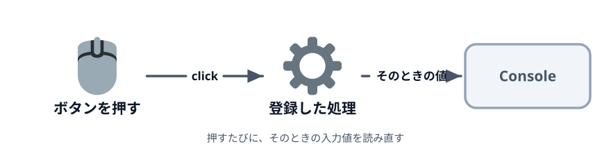
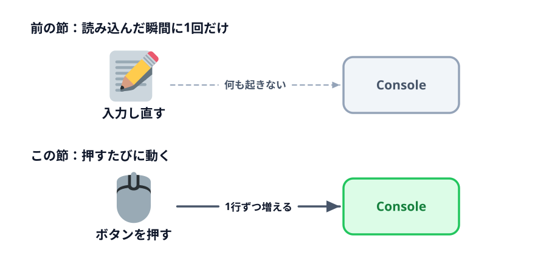

# 1-2 ボタンを押したときに取り出す



前の節のコードは、ページを開いた瞬間に1回だけ動きました。入力し直しても何も起きません。
この節では「生成」のきっかけになるボタンを置いて、**押されたときに**値を読むようにします。

> **今回さわるファイル:** `index.html` にボタンを足す

## 読み込んだ瞬間に1回しか動かない

前の節の `console.log(myInput.value)` は、`<script>` が読まれたその場で実行されます。
初期値の `月次報告` が1回出たきりで、そのあと入力欄に何を打ち込んでも Console は増えませんでした。



ほしいのは下の形です。「押されたら読む」にするには、処理を**その場で実行する**のではなく、
**ボタンに登録しておく**書き方に変えます。

## ボタンを置く

入力欄の下にボタンを足します。

:::code[`<input>` の `<p>` のすぐ下]{filepath=index.html offset=15}
```html
    <p>
      <button id="showButton">表示</button>
    </p>
```
:::

ボタンにも `id` を付けました。入力欄と同じで、JavaScript から取るためです。

保存して再読み込みすると、ボタンは出ますが押しても何も起きません。
HTML にボタンを置いただけでは、押したときに何をするかが決まっていないからです。

## クリックされたら動かす

`<script>` の中身を書き換えます。

:::code[`<script>` の中]{filepath=index.html offset=21 newOffset=25}
```js
  const myInput = document.getElementById('myInput');
- console.log(myInput.value);
+ const showButton = document.getElementById('showButton');
+
+ // ボタンが押されるたびに、そのときの入力値を読む。
+ // 読み込み時に1回だけ読むのでは、入力し直した値を拾えない。
+ showButton.addEventListener('click', () => {
+   console.log(myInput.value);
+ });
```
:::

`addEventListener` は、要素に対して「この出来事が起きたらこの処理を動かす」という対応を
**登録**する命令です。3つの部分からできています。

- `showButton` … どの要素に対してか
- `'click'` … 何が起きたときか
- `() => { ... }` … そのとき動かす処理

`() => { ... }` の中身は、この行を読んだ時点では**実行されません**。登録されるだけです。
実際に動くのは、あとでボタンが押されたときです。

## 何度も押してみる

保存して再読み込みし、`F12` で Console を開いておきます。

1. そのまま「表示」を押す → Console に `月次報告` が出る
2. 「安全点検」に書き換えて、もう一度押す → `安全点検` が1行増える
3. 空にして押す → 空の行が増える

押すたびに1行ずつ増えます。**押した瞬間の値**が読まれているからです。

## コラム: `onclick` 属性との違い

HTML に直接書く書き方もあります。

```html
<button onclick="console.log(myInput.value)">表示</button>
```

短く書けますが、HTML の中に処理が混ざります。ボタンが増えるほど、どこに何が書いてあるか
追いにくくなるので、この教材では `addEventListener` のほうを使います。

「HTML は要素を置く場所」「`<script>` は動きを決める場所」と分けておくと、
あとでフォームが3つに増えたときに読みやすくなります。

## 動かす

入力欄を書き換えて「表示」を押すたびに、そのときの値が Console に1行ずつ増えれば成功です。

::preview[このステップの完成イメージ（F12 で Console を開いてください）]{height="340"}

::codeview
