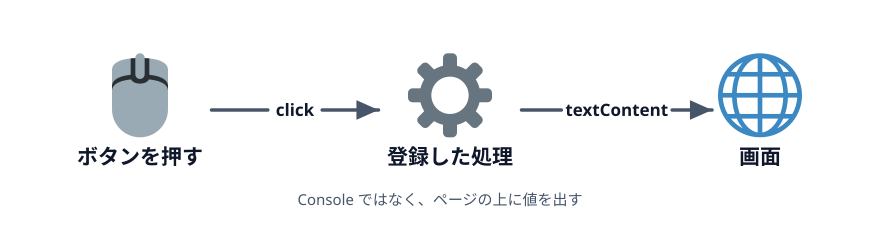
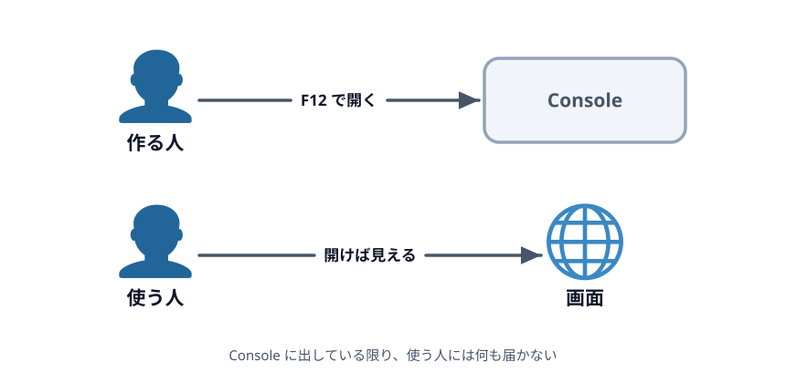
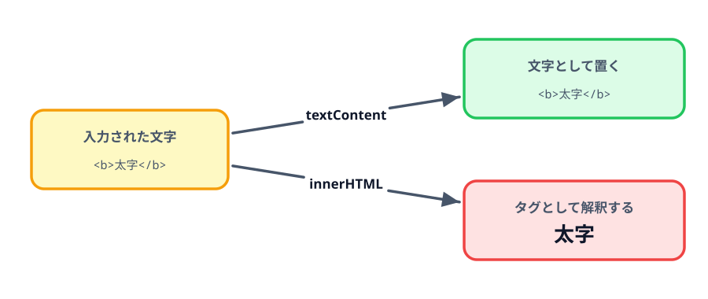

# 1-3 画面に表示する



Console に出せるようになりましたが、それを見るのは作っている人だけです。
この節では出力先を画面に変えて、ページを開いた人がそのまま読める形にします。

これで第1章は終わりです。次の章から、ここで取り出した値を使って URL を組み立てます。

> **今回さわるファイル:** `index.html` に出力先を足す

## Console は作る人しか見ない

Console は `F12` を押さないと出てきません。この道具の存在を知らない人にとっては、
ボタンを押しても何も起きないページに見えます。



値を使ってもらうには、ページの上に出す必要があります。

## 出力先を置く

結果を書き込む場所を、ボタンの下に用意します。

:::code[ボタンの `<p>` のすぐ下]{filepath=index.html offset=19}
```html
    <p>
      入力した値：<span id="result"></span>
    </p>
```
:::

`<span>` は中身が空です。ここに JavaScript から文字列を書き込みます。
表示する場所を先に HTML で決めておき、中身だけをあとから差し替えます。

この `<span>` にも `id` を付けました。入力欄・ボタンと同じで、JavaScript から取るためです。
**何かを JavaScript から触りたければ、まず `id` を付ける**。第1章で繰り返しているのはこれだけです。

## textContent で書き込む

`console.log` をやめて、`<span>` に書き込みます。

:::code[`<script>` の中]{filepath=index.html offset=25 newOffset=24}
```js
  const myInput = document.getElementById('myInput');
  const showButton = document.getElementById('showButton');
+ const result = document.getElementById('result');

  showButton.addEventListener('click', () => {
-   console.log(myInput.value);
+   result.textContent = myInput.value;
  });
```
:::

`textContent` に文字列を代入すると、その要素の中身がその文字列に置き換わります。
`console.log(...)` が**出力する命令**だったのに対して、`textContent = ...` は
**要素の中身を差し替える代入**です。

保存して再読み込みし、「表示」を押してください。
`F12` を開かなくても、画面の上に値が出るようになりました。

押すたびに**差し替わる**（増えない）ことも確かめてください。Console は履歴が積み上がりますが、
`textContent` は毎回上書きです。

空のまま押すと、表示も空になります。これも上書きが効いている証拠です。

## コラム: textContent と innerHTML

中身を書き換える方法はもう1つ、`innerHTML` があります。2つは扱いが違います。



入力欄に `<b>太字</b>` と打ち込んで試してみてください。`textContent` なら
`<b>太字</b>` という**文字がそのまま**出ます。`innerHTML` にすると、ブラウザがこれを
タグとして解釈し、**太字の「太字」**が出ます。

入力された値をそのまま見せたいときは `textContent` を使います。
`innerHTML` を使うのは、自分でタグを組み立てて差し込みたいときだけです。

第2章ではクリックできるリンクを作りたいので、そこで `innerHTML` を使います。
そして第3章で、その書き方をもっと素直なものに直します。

## 動かす

「表示」を押すと、`F12` を開かなくても画面に値が出れば成功です。

::preview[このステップの完成イメージ（実際に触って動かせます）]{height="320"}

::codeview
