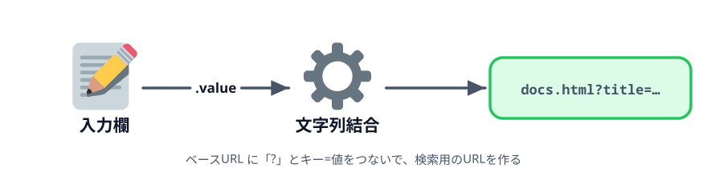
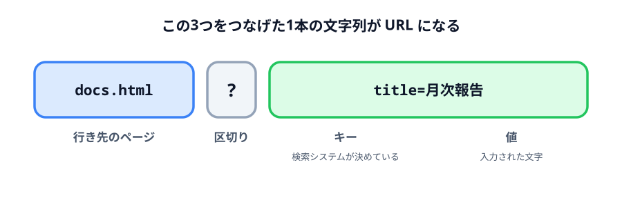

# 2-1 パラメータが1つのURLを作る



ここから URL を作ります。入力された件名を使って `docs.html?title=月次報告` という文字列を組み立て、
画面に表示します。使うのは文字列の足し算（`+`）だけです。

## この節で作るもの

::preview[この節の完成形（実際に触って動かせます）]{height="320"}

「生成」を押すと、件名を入れた URL が出ます。まだ文字列が出るだけで、クリックはできません。

> **今回さわるファイル:** `index.html` の `id` を変え、URL を組み立てる

## 作りたい URL の形

検索システムに値を渡す URL は、3つの部分からできています。



キーの名前（`title`）を決めるのは、こちらではなく**受け取る側の検索システム**です。
`title` に入れた値を件名として扱う、と向こうが決めているので、それに合わせて URL を組み立てます。

この教材では次の4つのキーを使います。いまの節で使うのは `title` だけです。

| 項目 | キー |
|---|---|
| 部署コード | `dept` |
| 件名 | `title` |
| 作成者 | `author` |
| 作成日 | `date` |

## 受け取り側のページを置く

リンクの行き先になる `docs.html` を `index.html` と同じフォルダに置きます。
このページは `::codeview` の一覧から中身を見られます。ダウンロードして同じフォルダに入れてください。

受け取ったパラメータを表に並べるだけのページです。本物の検索システムの代わりに、
「渡した値がちゃんと向こうに届いたか」を確かめるために使います。

:::notice
`docs.html` の中身は、第3章で読みます。いまは「受け取る側のページがある」とだけ分かっていれば十分です。
:::

## まず固定の文字列を出す

`id` を `myInput` から `title` に変えます。キー名と同じにしておくと、あとで対応が追いやすくなります。
ボタンの文言も「表示」から「生成」に変えます。

:::code[`<input>` と `<button>`]{filepath=index.html offset=10 newOffset=10}
```html
  <p>
    件名
-   <input id="myInput" value="月次報告" />
+   <input id="title" value="月次報告" />
  </p>

  <p>
-   <button id="showButton">表示</button>
+   <button id="generateButton">生成</button>
  </p>
```
:::

出力先の文言も「入力した値」から「生成されたURL」に変えておきます。

`<script>` 側も、変えた `id` に合わせます。まずは URL の形を確かめるために、
固定の文字列をそのまま出してみます。

:::code[`<script>` の中]{filepath=index.html offset=24 newOffset=24}
```js
- const myInput = document.getElementById('myInput');
- const showButton = document.getElementById('showButton');
+ const titleInput = document.getElementById('title');
+ const generateButton = document.getElementById('generateButton');
  const result = document.getElementById('result');

- showButton.addEventListener('click', () => {
-   result.textContent = myInput.value;
+ generateButton.addEventListener('click', () => {
+   result.textContent = 'docs.html?title=月次報告';
  });
```
:::

押すと `docs.html?title=月次報告` と表示されます。まだ入力欄は使っていません。

:::notice
変数名を `titleInput` にしたのは、`id` の `title` と区別するためです。
`title` という名前は HTML の `<title>` とも紛らわしいので、要素を入れる変数には
`〜Input` を付けておきます。
:::

## 入力値を差し込む

固定で書いていた「月次報告」のところを、入力された文字列に置き換えます。

:::code[`<script>` の中]{filepath=index.html offset=28 newOffset=28}
```js
  generateButton.addEventListener('click', () => {
-   result.textContent = 'docs.html?title=月次報告';
+   const url = 'docs.html?title=' + titleInput.value;
+
+   result.textContent = url;
  });
```
:::

`+` は文字列どうしをつなぐ演算子です。`'docs.html?title='` という固定部分のうしろに、
`titleInput.value` が返した文字列をくっつけて、1本の文字列にしています。

入力欄を「安全点検」に書き換えて押すと、表示も `docs.html?title=安全点検` に変わります。
第1章でやった「押したときの値を読む」が、そのまま効いています。

## 動かす

入力欄を書き換えて「生成」を押すと、表示される URL が変わります。

まだ文字列が出るだけで、クリックしても何も起きません。次の節でリンクにします。

::codeview
