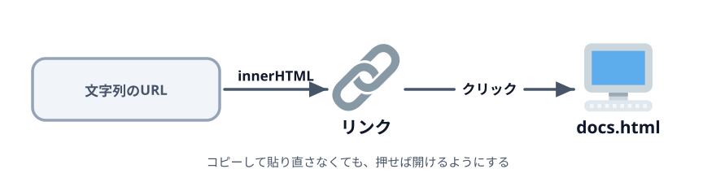
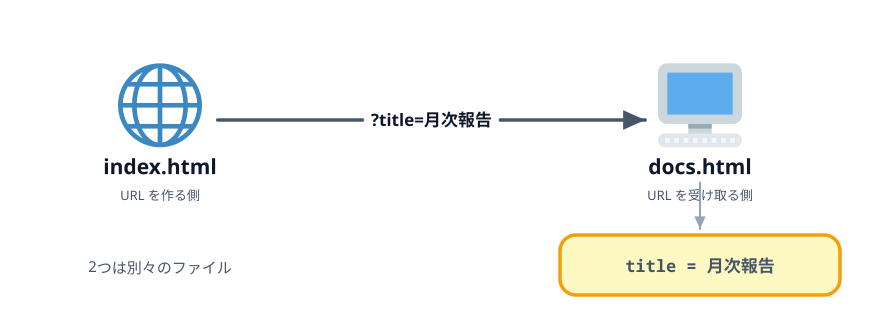

# 2-2 生成したURLをリンクにする



前の節で URL の文字列はできました。ただ、画面に文字が出るだけでは、使う人はそれを選択して
コピーし、アドレスバーに貼る必要があります。この節ではクリックで開けるリンクにします。

> **今回さわるファイル:** `index.html` の出力部分を書き換える

## 文字列のままでは使いにくい

いまの出力は `textContent` で書き込んだ、ただの文字です。
URL の形をしていても、ブラウザはそれをリンクとして扱いません。

リンクにするには `<a href="...">...</a>` という HTML が必要です。
これを JavaScript 側で組み立てて差し込みます。

## innerHTML で `<a>` を差し込む

第1章の最後に出てきた `innerHTML` を使います。`textContent` は渡した文字列を文字として置きますが、
`innerHTML` は**タグとして解釈**します。

:::code[`<script>` の中]{filepath=index.html offset=28 newOffset=28}
```js
  generateButton.addEventListener('click', () => {
    const url = 'docs.html?title=' + titleInput.value;

-   result.textContent = url;
+   result.innerHTML = '<a href="' + url + '" target="_blank">' + url + '</a>';
  });
```
:::

右辺は文字列の足し算です。`url` が `docs.html?title=月次報告` なら、つなげた結果はこうなります。

```html
<a href="docs.html?title=月次報告" target="_blank">docs.html?title=月次報告</a>
```

`url` を2回使っているのは、**行き先**（`href` の中）と**画面に出る文字**（タグに挟まれた部分）の
両方に同じものを入れたいからです。

:::notice
シングルクォート（`'`）で囲んだ文字列の中に、ダブルクォート（`"`）をそのまま書いています。
囲み文字を使い分けることで、途中で文字列が切れずに済みます。
:::

## 別タブで開く

`target="_blank"` を付けると、リンクを押したときに新しいタブで開きます。

同じタブで開いてしまうと、入力した内容ごと画面が切り替わり、条件を変えて作り直すたびに
戻るボタンを押すことになります。作る側のページは残しておきたいので `_blank` を付けます。

## 受け取り側で値を確かめる

保存して再読み込みし、「生成」を押してからリンクをクリックしてください。
新しいタブで `docs.html` が開き、渡した値が表に並びます。



`index.html` と `docs.html` は別々のファイルで、互いに何も知りません。
`title=月次報告` という**URL の文字列だけ**が、2つの間を渡っています。
これが「URL で値を渡す」ということです。

件名を「安全点検」に書き換えて、もう一度生成してリンクを押すと、受け取り側の表示も変わります。

## コラム: `textContent` に戻すと何が起きるか

試しに `innerHTML` を `textContent` に戻してみてください。
画面には `<a href="docs.html?title=月次報告" target="_blank">...` という**文字がそのまま**出ます。

`textContent` は中身を文字として置くので、`<a>` もただの記号として扱われます。
タグとして働かせたいときだけ `innerHTML` を使う、という使い分けです。

:::warning
`innerHTML` に入力された値を混ぜる書き方には弱点があります。いまは `url` に入る値を
自分で組み立てているので問題は起きませんが、第3章で、この書き方そのものを
もっと素直なものに直します。
:::

## 動かす

「生成」を押すとリンクが出て、クリックすると `docs.html` が別タブで開き、
渡した件名が表に出れば成功です。

::preview[このステップの完成イメージ（リンクを押すと受け取り側が開きます）]{height="340"}

::codeview
