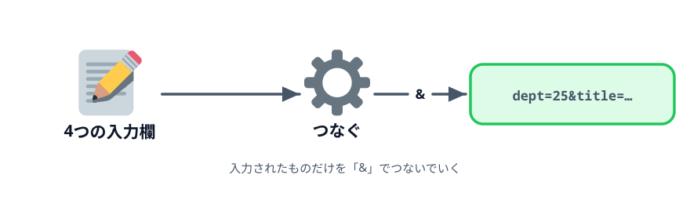
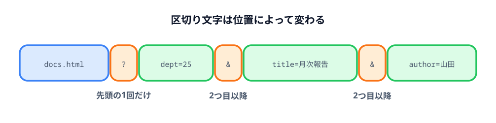
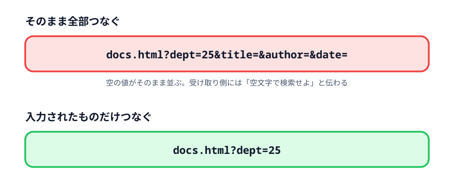

# 2-3 パラメータを増やす



件名だけでは検索条件として足りません。部署コード・件名・作成者・作成日の4項目にします。
項目が増えると、区切り文字の扱いと空欄の扱いという2つの面倒が出てきます。

## この節で作るもの

::preview[この節の完成形（空欄を混ぜて試してください）]{height="520"}

項目が4つになり、表で並びます。入力した項目だけが URL に入ります。

> **今回さわるファイル:** `index.html` に入力欄を3つ足す

## 項目を4つにする

入力欄が4つになるので、表に並べます。項目名・キー・入力欄・参考値の4列にしておくと、
使う人が「どこに何を入れるか」を迷いません。

表の見た目を整えるために `<style>` も足します。`<head>` の中、`<title>` の下に書きます。

:::code[`<head>` の中]{filepath=index.html offset=6}
```html
<style>
  table {
    border-collapse: collapse;
  }

  th,
  td {
    border: 1px solid #999;
    padding: 4px 10px;
    text-align: left;
  }

  th {
    background: #e2efda;
  }
</style>
```
:::

入力欄の `<p>` を、表に置き換えます。

:::code[`<h1>` の下。これまでの件名の `<p>` と入れ替える]{filepath=index.html offset=26}
```html
<table>
  <thead>
    <tr>
      <th>項目</th>
      <th>パラメータ名</th>
      <th>値</th>
      <th>参考値</th>
    </tr>
  </thead>
  <tbody>
    <tr>
      <td>部署コード</td>
      <td>dept</td>
      <td><input id="dept" /></td>
      <td>25、ALL</td>
    </tr>
    <tr>
      <td>件名</td>
      <td>title</td>
      <td><input id="title" /></td>
      <td>月次報告</td>
    </tr>
    <tr>
      <td>作成者</td>
      <td>author</td>
      <td><input id="author" /></td>
      <td>山田</td>
    </tr>
    <tr>
      <td>作成日</td>
      <td>date</td>
      <td><input id="date" /></td>
      <td>2026-04-01</td>
    </tr>
  </tbody>
</table>
```
:::

`value="月次報告"` は外しました。入れてほしい値は「参考値」の列で示せるので、
入力欄は空から始めます。

`<script>` の先頭も、増えた入力欄に合わせます。

:::code[`<script>` の先頭]{filepath=index.html offset=24 newOffset=72}
```js
- const titleInput = document.getElementById('title');
+ const deptInput = document.getElementById('dept');
+ const titleInput = document.getElementById('title');
+ const authorInput = document.getElementById('author');
+ const dateInput = document.getElementById('date');
  const generateButton = document.getElementById('generateButton');
  const result = document.getElementById('result');
```
:::

## 「&」でつなぐ

パラメータを2つ以上渡すときは `&` で区切ります。ただし、使う区切り文字は位置によって違います。



そこで、`?` から後ろの部分（**クエリ文字列**といいます）を変数に組み立ててから、
最後にベース URL とつなぐ形にします。

:::code[`<script>` のクリック処理]{filepath=index.html offset=28 newOffset=79}
```js
  generateButton.addEventListener('click', () => {
-   const url = 'docs.html?title=' + titleInput.value;
+   let query = '';
+
+   query = query + 'dept=' + deptInput.value;
+   query = query + '&title=' + titleInput.value;
+   query = query + '&author=' + authorInput.value;
+   query = query + '&date=' + dateInput.value;
+
+   const url = 'docs.html?' + query;

    result.innerHTML = '<a href="' + url + '" target="_blank">' + url + '</a>';
  });
```
:::

`const` ではなく `let` を使いました。`query` は4回書き換えるので、
あとから代入し直せる `let` が必要です。

## 空欄のまま押すとどうなるか

4項目すべてを埋めて押せば、思ったとおりの URL が出ます。
では部署コードだけ入れて、ほかを空のまま押してみてください。



`title=&author=&date=` が付いた URL ができます。リンクを押して受け取り側を見ると、
空の値が3つ並んでいます。受け取り側には「空文字で検索せよ」と伝わってしまうので、
入力されていない項目は**そもそも URL に入れない**のが正しい形です。

## 空欄を飛ばす

`if` で「入力されているものだけ足す」に変えます。

:::code[`<script>` のクリック処理]{filepath=index.html offset=28 newOffset=79}
```js
  generateButton.addEventListener('click', () => {
    let query = '';

-   query = query + 'dept=' + deptInput.value;
-   query = query + '&title=' + titleInput.value;
-   query = query + '&author=' + authorInput.value;
-   query = query + '&date=' + dateInput.value;
+   if (deptInput.value !== '') {
+     if (query !== '') {
+       query = query + '&';
+     }
+     query = query + 'dept=' + deptInput.value;
+   }
+
+   if (titleInput.value !== '') {
+     if (query !== '') {
+       query = query + '&';
+     }
+     query = query + 'title=' + titleInput.value;
+   }

    const url = 'docs.html?' + query;
```
:::

`author` と `date` も同じ形で書き足してください。4つとも同じ形の `if` が並びます。

## 「?」と「&」の使い分けが面倒になる

内側の `if` に注目してください。

```js
if (query !== '') {
  query = query + '&';
}
```

空欄を飛ばせるようにしたせいで、「いま足そうとしているものが先頭かどうか」が
実行してみるまで決まらなくなりました。部署コードが空なら件名が先頭になり、
件名も空なら作成者が先頭になります。

そのため、1つ足すたびに「もう何か入っているか」を確かめる必要があります。
項目が4つなら `if` が8個、10項目なら20個です。

書けば動きますが、本来やりたいのは「キーと値を足していく」ことだけのはずです。
第3章で、この区切り文字の面倒をまとめて手放します。

## 動かす

4項目のうちいくつかだけ入力して「生成」を押し、**入力した項目だけ**が URL に入っていれば成功です。

::codeview
