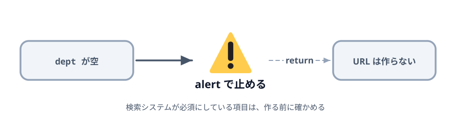
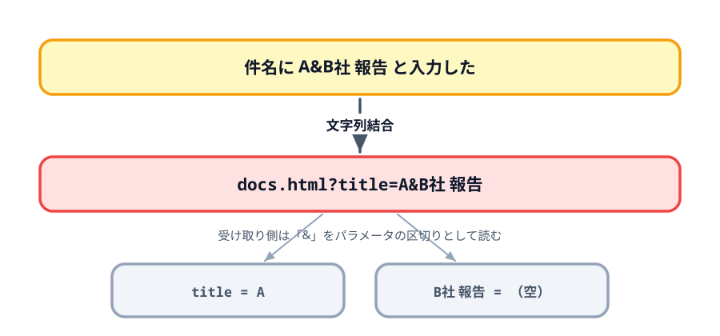

# 2-4 必須の項目をチェックする



検索システム側が「これが無いと検索できない」と決めている項目があります。
この教材では部署コード（`dept`）がそれにあたります。空のまま URL を作っても相手がエラーを返すだけなので、
作る前に止めます。

あわせて、文字列結合で組み立てることの限界も見ておきます。これが第3章の出発点になります。

## この節で作るもの

::preview[この節の完成形（部署コードを空にして押してみてください）]{height="520"}

部署コードが空のまま押すとダイアログが出て、URL は作られません。
件名に `A&B社 報告` と入れると、受け取り側で値が割れることも確かめられます。

> **今回さわるファイル:** `index.html` に必須チェックを足す

## 部署コードが無いと検索できない

いまは部署コードが空でも URL ができてしまいます。リンクを押すと受け取り側まで行って、
そこで初めて「部署コードがありません」と言われます。

押した時点で気づけるように、手前で止めます。

## alert で止める

クリック処理のいちばん最初に、`dept` が空かどうかを確かめます。

:::code[`<script>` のクリック処理の先頭]{filepath=index.html offset=79 newOffset=79}
```js
  generateButton.addEventListener('click', () => {
+   // 部署コードが無いと検索システム側がエラーになるので、ここで止める。
+   if (deptInput.value === '') {
+     alert('部署コードは必須です。');
+     return;
+   }
+
    let query = '';
```
:::

`alert` は、ブラウザが出す小さなダイアログに文字を表示する命令です。
`return` はこの関数をそこで終わらせます。`return` を書き忘れると、
ダイアログを閉じたあとに続きが実行され、結局 URL ができてしまいます。

保存して、部署コードを空のまま「生成」を押してください。ダイアログが出て、URL は作られません。

## 入れてはいけない文字を試す

必須チェックは入りましたが、入った値が正しく渡るかは別の話です。

部署コードに `25` を、件名に `A&B社 報告` と入れて生成し、リンクを押してみてください。
受け取り側の表が、おかしなことになっているはずです。



`&` はパラメータの区切り文字です。値の中に `&` が入ると、受け取り側はそこで区切って
別のパラメータとして読みます。件名は `A` だけになり、`B社 報告` という名前の空のパラメータが
勝手に増えます。

空白も同じように危険です。URL に空白はそのまま書けないので、
ブラウザやアプリによって扱いが変わり、途中で切れることがあります。

ほかにも `=` `?` `#` `+` `%` など、URL の中で意味を持つ記号はいくつもあります。
これらを1つずつ自分で置き換えていくのは現実的ではありません。

## この章のまとめ

第2章でやったことを並べます。

| やりたかったこと | 書いたこと |
|---|---|
| URL を組み立てる | `'docs.html?title=' + 値` |
| クリックできるようにする | `'<a href="' + url + '">' + url + '</a>'` |
| 項目を増やす | `&` でつなぐ |
| 空欄を飛ばす | `if` で判定して、先頭かどうかも毎回確かめる |
| 必須を守る | `alert` と `return` |

動くものはできました。ただし、区切り文字の使い分けも、記号の置き換えも、必須チェックも、
全部こちらで面倒を見ています。どれも「この教材だから特別」なことではなく、
**URL を扱うなら誰でも必要になること**です。

だから、ブラウザ側に最初から用意されています。第3章では、いま自分で書いた部分を
順番にそちらへ渡していきます。コードは短くなり、動きは変わりません。

## 動かす

部署コードを空にして押すとダイアログが出て、埋めて押すとリンクができれば成功です。
件名に `A&B社 報告` を入れて、受け取り側が割れることも確かめてください。

::codeview
