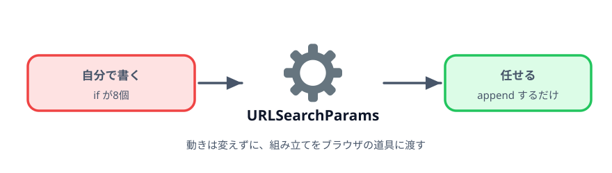
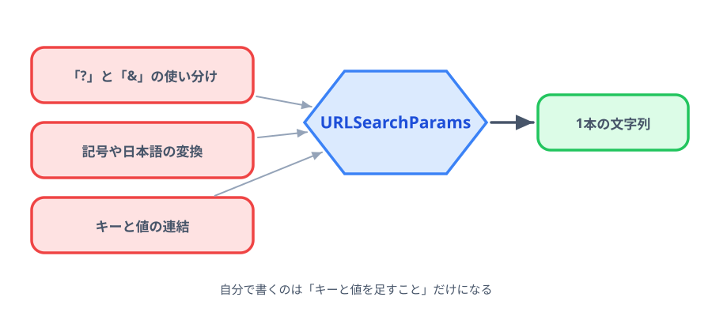

# 3-1 URLSearchParams に置き換える



動きは変えずに、クエリ文字列の組み立てだけを書き換えます。
第2章で残った2つの問題が、どちらも消えます。

> **今回さわるファイル:** `index.html` の組み立て部分を書き換える

## 文字列結合でつらかったこと

第2章の終わりで、2つの問題が残りました。

1. **区切り文字の使い分け** … 先頭なら `?`、2つ目以降なら `&`。空欄を飛ばすので、
   どれが先頭になるかは実行するまで決まらない。そのため足すたびに `if` で確かめている
2. **記号が壊れる** … 値に `&` や空白が入ると、受け取り側が別の意味に読んでしまう

どちらも、URL を扱う人なら誰でもぶつかります。だから `URLSearchParams` という道具が
ブラウザに最初から入っています。



## 壊れ方をもう一度確認する

書き換える前に、いま何が起きているかをもう一度見ておきます。
下のデモは、同じ入力を**文字列結合**と **URLSearchParams** の両方で組み立て、
受け取り側がそれぞれをどう読むかを並べたものです。

::preview[件名を書き換えると、受け取り側の読み取り結果が変わります]{demo="broken-url" height="420"}

件名に `&` を入れると、上は `title = 「A」` と `B社 向け/報告 = 「」` の2つに割れます。
下は `%26` などに変換されるので、1つの値として届きます。

::codeview[このデモのコード]{path="demos/broken-url"}

## URLSearchParams を使う

`let query = ''` から始まる組み立てを、まるごと書き換えます。

:::code[`<script>` のクリック処理]{filepath=index.html offset=87 newOffset=86}
```js
-   let query = '';
+   // クエリ文字列を組み立てる道具。
+   // 「&」でつなぐのも、空白や日本語の変換も URLSearchParams がやってくれる。
+   const params = new URLSearchParams();

    if (deptInput.value !== '') {
-     if (query !== '') {
-       query = query + '&';
-     }
-     query = query + 'dept=' + deptInput.value;
+     params.append('dept', deptInput.value);
    }
```
:::

残り3つの `if` も同じように書き換えます。最後に文字列にします。

:::code[`<script>` のクリック処理の終わり]{filepath=index.html offset=119 newOffset=106}
```js
-   const url = 'docs.html?' + query;
+   const url = 'docs.html?' + params.toString();
```
:::

使っているのは2つだけです。

- `params.append('dept', 値)` … キーと値の組を1つ足す
- `params.toString()` … 足したものを1本のクエリ文字列にする

## 「?」と「&」の分岐が消える

書き換え後の `if` を見てください。

```js
if (deptInput.value !== '') {
  params.append('dept', deptInput.value);
}
```

内側の `if (query !== '')` が無くなりました。区切り文字をどこに入れるかは `toString()` が
決めるので、こちらが「いま何番目か」を知っている必要がないからです。

4項目で8個あった `if` が4個になり、項目が増えても1項目につき1個のままです。

## 日本語も記号も通る

件名に `A&B社 報告` と入れて生成してください。できる URL はこうなります。

```text
docs.html?dept=25&title=A%26B%E7%A4%BE+%E5%A0%B1%E5%91%8A
```

読みにくいですが、これで正しい形です。`&` は `%26` に、空白は `+` に、日本語は `%E7%A4%BE` のような
並びに置き換わっています。この変換を **URL エンコード**といいます。

リンクを押して受け取り側を見ると、`title = A&B社 報告` と**元どおりに**表示されます。
受け取る側が同じ規則で元に戻すからです。

第2章で割れていた値が、何も足していないのに1つの値として届くようになりました。

## コラム: 受け取り側も URLSearchParams

同梱の `docs.html` が、どうやって値を読んでいるかを見てみます。

```js
const params = new URLSearchParams(location.search);

params.forEach((value, key) => {
  // key と value を表に並べる
});
```

`location.search` は、いま開いている URL の `?` から後ろの文字列です。
それを `URLSearchParams` に渡すと、キーと値の組として読み出せます。

作る側は `append` して `toString()`、読む側は渡して `forEach`。
同じ道具を両側で使うので、エンコードの規則がずれません。

## 動かす

第2章と同じように動けば成功です。見た目も操作も変わりません。
変わったのは、生成される URL の記号の扱いと、コードの短さだけです。

::preview[このステップの完成イメージ（件名に & を入れて試してください）]{height="520"}

::codeview
