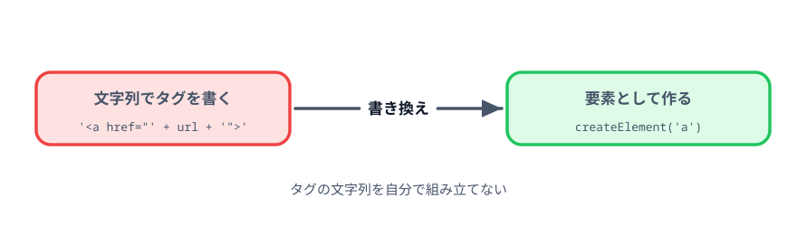
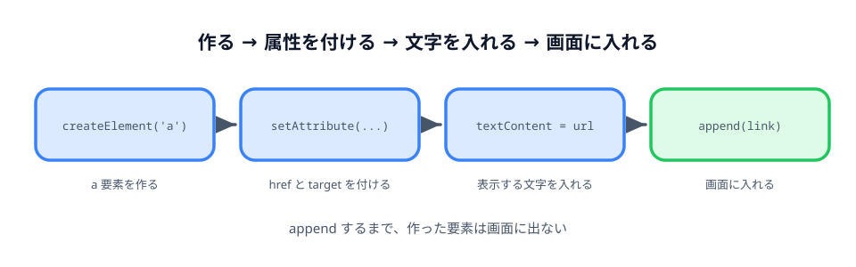

# 3-2 リンクを要素として作る



前の節で、URL の組み立ては `URLSearchParams` に任せました。
同じ考えを、リンクを作っている部分にも当てます。

> **今回さわるファイル:** `index.html` の出力部分を書き換える

## 文字列でタグを組み立てている

いまリンクを作っているのはこの1行です。

```js
result.innerHTML = '<a href="' + url + '" target="_blank">' + url + '</a>';
```

やっていることは、前の節でやめたのと同じ「文字列の足し算」です。
引用符の開き閉じ、`>` の位置、閉じタグ。どれも自分で正しく並べる必要があります。

`innerHTML` は渡された文字列を**タグとして解釈**するので、組み立てを1か所でも間違えると、
表示が崩れたり、意図しないタグが差し込まれたりします。

## createElement で `<a>` を作る

文字列ではなく、要素そのものを作ります。



```js
const link = document.createElement('a');
```

`document.createElement('a')` は、新しい `a` 要素を1つ作って返します。
`getElementById` が**すでにあるものを探す**のに対して、`createElement` は**新しく作る**命令です。

作った時点では、まだどこにも置かれていないので画面には出ません。

## setAttribute で href と target を付ける

属性は `setAttribute(属性名, 値)` で足します。

```js
link.setAttribute('href', url);
link.setAttribute('target', '_blank');
```

文字列で書いていたときは、`'<a href="' + url + '"'` のように引用符を自分で閉じていました。
`setAttribute` なら値を渡すだけで、引用符の開き閉びを気にする必要がありません。

## 中身を入れ替える

リンクに表示する文字を入れて、出力先に差し込みます。

:::code[`<script>` のクリック処理の終わり]{filepath=index.html offset=106 newOffset=106}
```js
    const url = 'docs.html?' + params.toString();

-   result.innerHTML = '<a href="' + url + '" target="_blank">' + url + '</a>';
+   // リンクも文字列で組み立てるのをやめ、要素として作る。
+   const link = document.createElement('a');
+   link.setAttribute('href', url);
+   link.setAttribute('target', '_blank');
+   link.textContent = url;
+
+   // 前に作ったリンクが残らないように、中身を空にしてから入れる。
+   result.textContent = '';
+   result.append(link);
  });
```
:::

`append` は、要素の中に別の要素を追加する命令です。**追加**なので、
`result.textContent = ''` で空にしておかないと、押すたびにリンクが下に増えていきます。

:::notice
試しに `result.textContent = '';` の行を消して、何度か「生成」を押してみてください。
リンクが2本、3本と並びます。`innerHTML` への代入が**置き換え**だったのに対し、
`append` は**追加**だという違いです。
:::

## コラム: innerHTML に入力値を混ぜると

この節の書き換えは、見た目も動きも変わりません。では何が変わったのか。

下のデモは、同じ入力文字を `innerHTML` に文字列で渡した場合と、
`createElement` と `textContent` で入れた場合を並べたものです。

::preview[件名を書き換えると、上下の出方が変わります]{demo="innerhtml-risk" height="420"}

件名に `<b>至急</b> 月次報告` と入れると、上は「至急」が太字になります。
入力された文字がタグとして解釈されたからです。下はそのまま文字として出ます。

::codeview[このデモのコード]{path="demos/innerhtml-risk"}

いまの `index.html` は `URLSearchParams` を通した `url` だけを渡しているので、
この問題は起きません。ただし「文字列でタグを組み立てる」書き方を続ける限り、
どこか1か所で変換を忘れたときに同じことが起こります。

要素として作れば、入力された値は常に文字としてしか扱われません。
気をつけて書く必要そのものが無くなります。

## 動かす

前の節と同じように、生成したリンクを押すと `docs.html` が開けば成功です。
何度押してもリンクが1本のままであることも確かめてください。

::preview[このステップの完成イメージ（何度か押してみてください）]{height="520"}

::codeview
