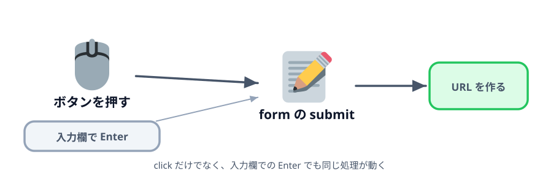
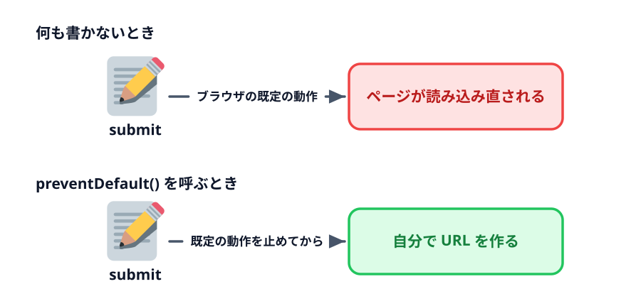

# 3-3 フォームの submit を使う



ボタンの `click` で動かしてきましたが、入力欄で Enter を押しても何も起きません。
必須チェックも `alert` で自前です。どちらもブラウザが元から持っている仕組みに任せられます。

## この節で作るもの

::preview[この節の完成形（Enter と空欄を試してください）]{height="520"}

入力欄で Enter を押しても生成できます。部署コードを空にすると、ブラウザ自身が吹き出しで止めます。

> **今回さわるファイル:** `index.html` を `<form>` で囲む

## いまのボタンの不満

2つあります。

1. **Enter で動かない** … 入力欄に打ち込んだあと、マウスでボタンを押しに行く必要がある
2. **必須チェックが自前** … `if` と `alert` と `return` を自分で書いている。
   項目が増えればそのぶん増える

どちらも「入力して送信する」という、どのページにもある動きです。
HTML の `<form>` を使うと、この2つがそのまま手に入ります。

## `<form>` で囲む

表とボタンを `<form>` で囲み、ボタンを `type="submit"` にします。

:::code[`<table>` と `<button>` の `<p>` をまとめて囲む]{filepath=index.html offset=26 newOffset=26}
```html
+ <form id="searchForm">
    <table>
      ...
    </table>

    <p>
-     <button id="generateButton">生成</button>
+     <button type="submit">生成</button>
    </p>
+ </form>
```
:::

ボタンの `id` は外しました。これから `click` ではなく form の `submit` を見るので、
ボタン自体を JavaScript から取る必要がなくなります。

## 既定の動作を止める

`<form>` の中のボタンを押すと、**submit** という出来事が起きます。
ただし、何も書かないとブラウザが勝手にフォームを送信してしまいます。



下のデモで、止めなかった場合の動きを見てください。「生成」を押すと、
ブラウザが自分で URL を組み立てて、同じページを読み込み直します。

::preview[「生成」を押すと、ブラウザ自身が URL を作って再読み込みします]{demo="no-prevent-default" height="380"}

::codeview[このデモのコード]{path="demos/no-prevent-default"}

行き先も形もこちらでは選べないので、この動作を止めてから自分で URL を作ります。
止める命令が `event.preventDefault()` です。

:::code[`<script>` の中]{filepath=index.html offset=76 newOffset=74}
```js
- const generateButton = document.getElementById('generateButton');
+ const searchForm = document.getElementById('searchForm');
  const deptInput = document.getElementById('dept');
  ...
  const result = document.getElementById('result');

- generateButton.addEventListener('click', () => {
-   if (deptInput.value === '') {
-     alert('部署コードは必須です。');
-     return;
-   }
+ // submit は「生成」ボタンのクリックだけでなく、
+ // 入力欄で Enter を押したときにも起きる。
+ searchForm.addEventListener('submit', (event) => {
+   // ブラウザはこのあと勝手にフォームを送信してページを読み込み直す。
+   // 自分でURLを組み立てたいので、その既定の動作を止める。
+   event.preventDefault();
```
:::

`(event)` は、起きた出来事そのものを受け取る引数です。そこに生えている
`preventDefault()` を呼ぶと、ブラウザの既定の動作だけが取り消されます。

## Enter キーで動く

保存して再読み込みし、入力欄に文字を打ち込んだ状態で **Enter** を押してください。
ボタンを押したときと同じように URL ができます。

`click` を見ていたときは、クリックという1つの操作しか拾えませんでした。
`submit` はフォームの送信そのものを指すので、ボタンでも Enter でも同じ処理が動きます。

## 必須チェックをブラウザに任せる

`alert` を消した代わりに、HTML 側で必須だと書きます。

:::code[部署コードの `<input>`]{filepath=index.html offset=39 newOffset=40}
```html
- <td><input id="dept" /></td>
+ <td><input id="dept" required /></td>
```
:::

`required` が付いた入力欄が空のまま submit しようとすると、ブラウザが送信を止めて
「このフィールドを入力してください」と吹き出しを出します。
`submit` の処理そのものが呼ばれないので、`if` で確かめる必要がありません。

`alert` との違いは、**どの欄が足りないかをブラウザが指し示してくれる**ことです。
項目が増えても、`required` を付けるだけで済みます。

## ラベルと入力欄を結びつける

表の「項目」の列を `<label>` にします。

:::code[各行の項目名]{filepath=index.html offset=37 newOffset=38}
```html
- <td>部署コード</td>
+ <td><label for="dept">部署コード</label></td>
```
:::

`for` に入力欄の `id` を書くと、2つが結びつきます。項目名をクリックすると
その入力欄にカーソルが移るので、表の中でも狙った欄に入りやすくなります。

4行とも同じように書き換えてください。

## コラム: 入力欄の type

作成日の欄を `type="date"` にします。

```html
<td><input id="date" type="date" /></td>
```

カレンダーから選べるようになり、`2026-04-01` の形で値が入ります。
`2026/4/1` や `4月1日` のような揺れが起きません。

`type` にはほかに `number` `email` `url` などがあり、どれも入力と検証をブラウザが引き受けます。
これも「自分で書かずに任せる」の一例です。

## 動かす

次の3つを確かめてください。

- 入力欄で Enter を押すと URL ができる
- 部署コードを空にして押すと、ブラウザの吹き出しが出て処理が動かない
- 「部署コード」の文字をクリックすると、その入力欄にカーソルが移る

::codeview
