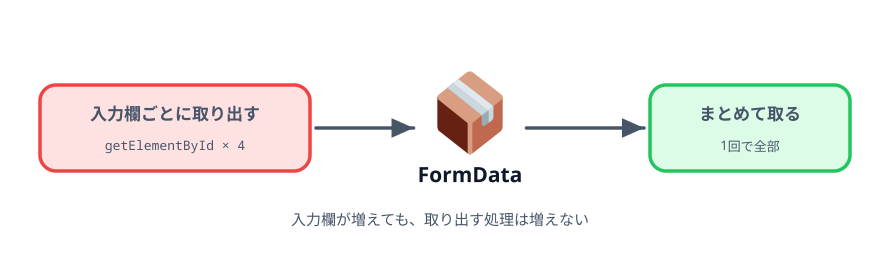
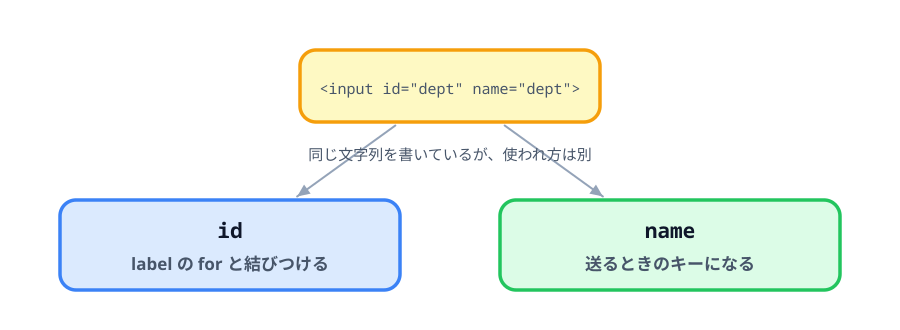

# 3-4 FormData でまとめて取り出す



第3章の最後です。入力欄を1つずつ取り出している部分を、フォームごとまとめて取る形にします。
これで、入力欄が増えても `<script>` を書き足さなくて済むようになります。

## この節で作るもの

::preview[この節の完成形（空欄を混ぜて試してください）]{height="520"}

動きは前の節と変わりません。変わったのは、入力欄を取り出す `<script>` の書き方だけです。

> **今回さわるファイル:** `index.html` の取り出し部分を書き換える

## 入力欄の数だけ同じ行が並んでいる

いまの `<script>` には、同じ形が4回ずつ出てきます。

```js
const deptInput = document.getElementById('dept');
const titleInput = document.getElementById('title');
const authorInput = document.getElementById('author');
const dateInput = document.getElementById('date');
```

```js
if (deptInput.value !== '') {
  params.append('dept', deptInput.value);
}
// ...あと3つ
```

項目を1つ増やすたびに、HTML に1行、`<script>` に2か所を足すことになります。
3か所のどれかを忘れると、その項目だけ URL に入りません。

## name 属性を付ける

フォームの中身をまとめて取るには、各入力欄に `name` を付けます。

:::code[各行の `<input>`]{filepath=index.html offset=40 newOffset=40}
```html
- <td><input id="dept" required /></td>
+ <td><input id="dept" name="dept" required /></td>
```
:::

4つとも同じように、`id` と同じ文字列を `name` にも書きます。

`id` はそのまま残します。2つは役割が違うからです。



- **`id`** … ページの中でその要素を指す名前。`label` の `for` と `getElementById` が使う
- **`name`** … フォームを送るときのキー。`FormData` と、ブラウザ自身の送信が使う

今回はどちらも `dept` にしていますが、別々の文字列にもできます。同じにしておくほうが追いやすいので
そろえているだけです。

## FormData でまとめて取り出す

`<script>` を書き換えます。入力欄ごとの変数も、`if` の繰り返しも消えます。

:::code[`<script>` の中]{filepath=index.html offset=74 newOffset=74}
```js
  const searchForm = document.getElementById('searchForm');
- const deptInput = document.getElementById('dept');
- const titleInput = document.getElementById('title');
- const authorInput = document.getElementById('author');
- const dateInput = document.getElementById('date');
  const result = document.getElementById('result');

  searchForm.addEventListener('submit', (event) => {
    event.preventDefault();

    const params = new URLSearchParams();

-   if (deptInput.value !== '') {
-     params.append('dept', deptInput.value);
-   }
-   // ...あと3つ
+   // FormData はフォームの中の name 属性が付いた入力欄を
+   // 「name と値」の組でまとめて取り出す。
+   // 入力欄が増えても、ここを書き足す必要がなくなる。
+   new FormData(searchForm).forEach((value, name) => {
+     if (value !== '') {
+       params.append(name, value);
+     }
+   });
```
:::

`new FormData(searchForm)` は、そのフォームの中にある `name` 付きの入力欄をすべて集めます。
`forEach` はその1つずつについて、`value`（入力された文字列）と `name`（キー）を渡して
中の処理を呼びます。

空欄を飛ばす `if` は1つだけ残りました。4項目でも10項目でも、この1つで足ります。

表に行を足して `name` を付ければ、`<script>` は何も変えずに新しい項目が URL に入ります。

## getElementById はどこに残るか

全部消えたわけではありません。残っているのはこの2つです。

```js
const searchForm = document.getElementById('searchForm');
const result = document.getElementById('result');
```

フォーム自身と、結果を書き込む `<span>` です。
**決まった1つの要素を指して取る**という用途では、いまも `getElementById` を使います。

消えたのは「同じことを入力欄の数だけ繰り返す」部分だけです。

## コラム: 1行で済ませると何が変わるか

`URLSearchParams` は `FormData` をそのまま受け取れるので、実はこう書けます。

```js
const params = new URLSearchParams(new FormData(searchForm));
```

`forEach` が消えて1行になります。ただし、この書き方では**空欄も入ります**。
部署コードだけ入れて押すと `?dept=25&title=&author=&date=` ができてしまい、
第2章で直した問題が戻ってきます。

空欄を落としたいので、この教材では `forEach` で1つずつ確かめる形を採っています。
短いほうがいつも良いわけではない、という例です。

## コラム: ブラウザ自身の送信との関係

`name` は、もともと**ブラウザがフォームを送るときのキー**です。
前の節で `preventDefault()` を外したときに出た `?title=月次報告` という URL も、
ブラウザが `name` を見て組み立てたものでした。

つまり `FormData` は、ブラウザが送信のときにやっていることを、
自分の処理の中から使えるようにしたものです。

## この章のまとめ

第3章では、書いたコードの量が減りました。消えたものを並べます。

| 消えたもの | 代わりにやってくれるもの |
|---|---|
| `?` と `&` の使い分け | `URLSearchParams` |
| 記号や日本語の変換 | `URLSearchParams` |
| タグの文字列の組み立て | `createElement` / `setAttribute` |
| `alert` での必須チェック | `required` |
| 入力欄ごとの `getElementById` と `if` | `FormData` |

画面の見た目も操作も、第2章の終わりと同じです。変わったのは、
**自分で面倒を見る範囲**だけです。

次の章では、このフォームを同じ画面に並べます。

## 動かす

いくつかの項目だけ入力して「生成」を押し、入力した項目だけが URL に入れば成功です。
`required` と Enter も、前の節のまま効いています。

::codeview
