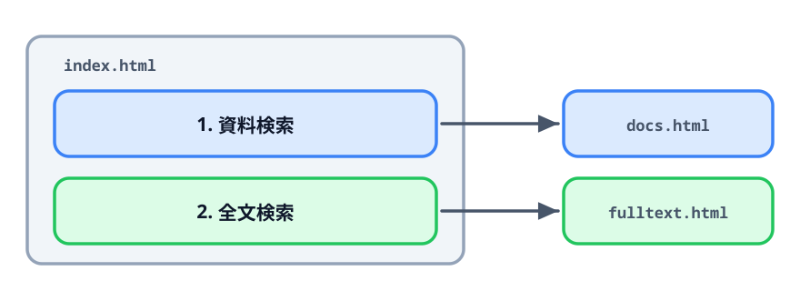
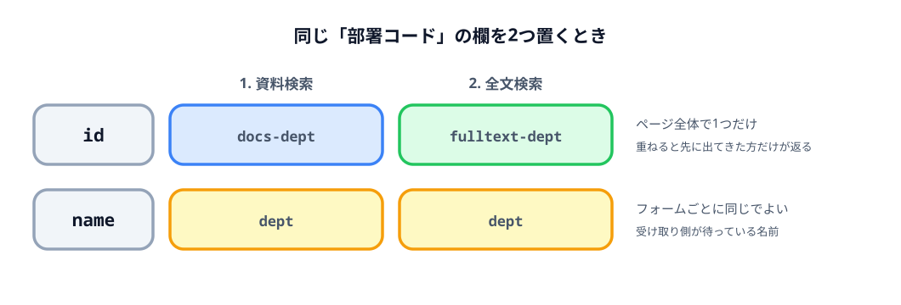

# 4-1 同じ画面に2つ目のフォームを足す



ここまで育ててきたのは資料検索のフォームでした。この節では、同じ `index.html` の中に
全文検索のフォームを足して、1枚のページから2種類の URL を作れるようにします。

やることは「1つ目をコピーして書き換える」だけです。ただし `id` だけは、
コピーしたままにできません。

## この節で作るもの

::preview[この節の完成形（上と下の「生成」を順に押してみてください）]{height="640"}

資料検索と全文検索の2つのフォームが並びます。それぞれ別の行き先の URL ができます。

> **今回さわるファイル:** `index.html` に2つ目のフォームを足す

## 検索は1種類ではない

資料検索のほかに、本文の中の語句で探す全文検索があります。
受け取り側のページも、渡すパラメータも別物です。

| | 行き先 | パラメータ |
|---|---|---|
| 資料検索 | `docs.html` | `dept` / `title` / `author` / `date` |
| 全文検索 | `fulltext.html` | `dept` / `word1` / `word2` / `word3` |

`index.html` をもう1枚別に作る手もあります。ただしそうすると、使う人は
「どっちのファイルを開くんだったか」を毎回思い出すことになります。
1枚に並べておけば、開くファイルは1つで済みます。

## 見出しで区切る

2つ並べるので、どこからどこまでが1つのフォームなのかを見出しで示します。
まずページ全体の名前を、資料検索だけのものではなくします。

:::code[`<head>` の中]{filepath=index.html offset=5 newOffset=5}
```html
- <title>資料検索のURLを作る</title>
+ <title>検索URLを作る</title>
```
:::

`<h1>` も同じように変えて、その下に `<h2>` を足します。

:::code[`<body>` の先頭]{filepath=index.html offset=24 newOffset=24}
```html
- <h1>資料検索のURLを作る</h1>
+ <h1>検索URLを作る</h1>
+
+ <h2>1. 資料検索</h2>
```
:::

`<h2>` は `<h1>` より1段下の見出しです。ページ全体の名前が `<h1>`、
その中の1つのまとまりが `<h2>` という関係になります。

番号を振っておくと、使う人に「ほかにもある」ことが伝わります。

## コピーして貼る

`<h2>1. 資料検索</h2>` から結果の `<p>` までが、1つ分のまとまりです。
これをまるごとコピーして、すぐ下に貼り付けます。貼り付けたほうを全文検索用に書き換えます。

:::code[1つ目の結果の `<p>` の下。コピーしたものを書き換える]{filepath=index.html offset=75}
```html
<h2>2. 全文検索</h2>

<form id="fulltextForm">
  <table>
    <thead>
      <tr>
        <th>項目</th>
        <th>パラメータ名</th>
        <th>値</th>
        <th>参考値</th>
      </tr>
    </thead>
    <tbody>
      <tr>
        <td><label for="fulltext-dept">部署コード</label></td>
        <td>dept</td>
        <td><input id="fulltext-dept" name="dept" required /></td>
        <td>25、ALL</td>
      </tr>
      <tr>
        <td><label for="fulltext-word1">検索語句(1)</label></td>
        <td>word1</td>
        <td><input id="fulltext-word1" name="word1" /></td>
        <td>安全</td>
      </tr>
      <tr>
        <td><label for="fulltext-word2">検索語句(2)</label></td>
        <td>word2</td>
        <td><input id="fulltext-word2" name="word2" /></td>
        <td>点検</td>
      </tr>
      <tr>
        <td><label for="fulltext-word3">検索語句(3)</label></td>
        <td>word3</td>
        <td><input id="fulltext-word3" name="word3" /></td>
        <td></td>
      </tr>
    </tbody>
  </table>

  <p>
    <button type="submit">生成</button>
  </p>
</form>

<p>
  生成されたURL：<span id="fulltextResult"></span>
</p>
```
:::

コピーしたものから書き換えたのは4か所です。

- `<h2>` の文字を「2. 全文検索」に
- `<form>` の `id` を `fulltextForm` に
- 表の行を `word1` / `word2` / `word3` に（部署コードの行はそのまま使う）
- 結果の `<span>` の `id` を `fulltextResult` に

検索語句の欄に `required` は付けません。3つのうちどれか1つ入っていれば検索できるので、
特定の欄を必須にはできないからです。

行き先の `fulltext.html` はまだどこにも出てきていません。あとで `<script>` に書きます。

`id` に `fulltext-` を付けた理由は、次で説明します。

## id はページ全体で1つだけ

コピーしたままにすると、`id="dept"` がページの中に2つできます。
`id` はページの中でその要素を指す名前なので、同じものを2つ置くことはできません。

試すと分かります。2つ目の `id` と `for` を `dept` に戻して保存し、
2つ目の「部署コード」の文字をクリックしてください。カーソルは **1つ目**の入力欄に入ります。
`<label for="dept">` が探した先が、先に出てきた `<input>` だからです。
`document.getElementById('dept')` も同じで、1つ目だけが返ります。

エラーは出ません。動いているように見えて、片方だけが無視されます。
確かめたら `fulltext-dept` に戻してください。



そこで、入力欄の `id` には「どのフォームのものか」が分かる接頭辞を付けます。
2つ目を `fulltext-` にしたので、1つ目は `docs-` にします。

まず `<form>` の `id` です。

:::code[1つ目の `<form>` の開始タグ]{filepath=index.html offset=26 newOffset=28}
```html
- <form id="searchForm">
+ <form id="docsForm">
```
:::

入力欄は `id` と、`label` の `for` を同じ文字列に直します。

:::code[1つ目のフォームの部署コードの行]{filepath=index.html offset=38 newOffset=40}
```html
- <td><label for="dept">部署コード</label></td>
+ <td><label for="docs-dept">部署コード</label></td>
  <td>dept</td>
- <td><input id="dept" name="dept" required /></td>
+ <td><input id="docs-dept" name="dept" required /></td>
```
:::

`title` / `author` / `date` の3行も同じように `docs-` を付けてください。

結果の `<span>` も、2つ並ぶので付け替えます。

:::code[1つ目の結果の `<p>`]{filepath=index.html offset=70 newOffset=72}
```html
- 生成されたURL：<span id="result"></span>
+ 生成されたURL：<span id="docsResult"></span>
```
:::

**`name` は両方とも `dept` のままです。** `name` はフォームを送るときのキーで、
`FormData` はフォーム単位で集めます。別のフォームに同じ `name` があっても混ざりません。

むしろ、ここは同じでなければいけません。受け取り側はどちらも `dept` という名前で待っているので、
`docs-dept` のような名前で送ると受け取ってもらえなくなります。

第3章で `id` と `name` を別々に書いたのは、この場面のためです。
ページの中で要素を指す名前（`id`）と、相手に渡すキー（`name`）は、
別々に決められる必要がありました。

## 処理も2つ並べる

`<script>` の中も2つに分けます。1つ目は名前を付け替えて、コメントで区切るだけです。

:::code[`<script>` の先頭]{filepath=index.html offset=74 newOffset=125}
```js
+ // 資料検索
- const searchForm = document.getElementById('searchForm');
- const result = document.getElementById('result');
+ const docsForm = document.getElementById('docsForm');
+ const docsResult = document.getElementById('docsResult');
```
:::

付け替えた名前は、処理の中でも使われています。3か所あります。

:::code[`<script>` の submit 処理]{filepath=index.html offset=77 newOffset=129}
```js
- searchForm.addEventListener('submit', (event) => {
+ docsForm.addEventListener('submit', (event) => {
    event.preventDefault();

    const params = new URLSearchParams();

-   new FormData(searchForm).forEach((value, name) => {
+   new FormData(docsForm).forEach((value, name) => {
      if (value !== '') {
        params.append(name, value);
      }
    });

    const url = 'docs.html?' + params.toString();

    const link = document.createElement('a');
    link.setAttribute('href', url);
    link.setAttribute('target', '_blank');
    link.textContent = url;

-   result.textContent = '';
-   result.append(link);
+   docsResult.textContent = '';
+   docsResult.append(link);
  });
```
:::

ここまでで、画面は2つぶんになりましたが、動くのは1つ目だけです。
2つ目のフォームは、押しても何も起きません。処理がまだ無いからです。

1つ目をまるごとコピーして、その下に貼り付けます。

:::code[`<script>` の中。1つ目の `});` の下]{filepath=index.html offset=151}
```js
// 全文検索
// 資料検索とよく似た処理だが、まとめずにそれぞれ書く。
// 行き先も項目も別物なので、片方を直してもう片方が壊れるのを避ける。
const fulltextForm = document.getElementById('fulltextForm');
const fulltextResult = document.getElementById('fulltextResult');

fulltextForm.addEventListener('submit', (event) => {
  event.preventDefault();

  const params = new URLSearchParams();

  new FormData(fulltextForm).forEach((value, name) => {
    if (value !== '') {
      params.append(name, value);
    }
  });

  const url = 'fulltext.html?' + params.toString();

  const link = document.createElement('a');
  link.setAttribute('href', url);
  link.setAttribute('target', '_blank');
  link.textContent = url;

  fulltextResult.textContent = '';
  fulltextResult.append(link);
});
```
:::

コピーしてから変えたのは、次の3か所だけです。

| 変えるところ | 資料検索 | 全文検索 |
|---|---|---|
| どのフォームか | `docsForm` | `fulltextForm` |
| 行き先 | `'docs.html?'` | `'fulltext.html?'` |
| どこに出すか | `docsResult` | `fulltextResult` |

**項目の数が違うのに、`forEach` の中は1文字も変わりません。**
`FormData` はそのフォームにある `name` を集めるだけなので、
4項目でも3項目でも、名前が `title` でも `word1` でも、同じ処理で通ります。

入力欄ごとの `getElementById` が残っていたら、ここで4行をコピーして
`word1` / `word2` / `word3` に書き換える作業が増えていました。
第3章でそれをやめておいたぶんが、ここで効いています。

## なぜまとめないのか

2つの処理は、見比べると3か所しか違いません。
「関数にまとめれば1回書くだけで済む」と考えるのが自然な場面です。

この教材ではまとめません。理由は2つあります。

1つ目は、**上から順に読めば全部わかる**状態が保てることです。
「2. 全文検索」で何が起きるかを知りたい人は、`// 全文検索` から下だけを読めば済みます。
まとめると、呼び出しているところと関数の中を行き来しながら読むことになります。

2つ目は、**片方を直してもう片方が壊れない**ことです。
たとえば全文検索だけ「語句が1つも入っていなければ止める」ようにしたくなったとき、
`// 全文検索` の中に `if` を1つ足すだけで済みます。
共通の関数に手を入れると、頼んでいない資料検索にもその判定が入ります。

いま似ているのは、たまたま似ているだけです。同じものだと決まったわけではありません。
次の節で3つ目を足してから、この話をもう一度します。

## 動かす

`index.html` を Edge で開いて、フォームが2つ並んでいることを確認します。
次の3つを確かめてください。

- 上の「生成」で `docs.html?...`、下の「生成」で `fulltext.html?...` ができる
- どちらのリンクも、それぞれの受け取り側のページが開く
- 上の「生成」を押しても、下の結果欄は変わらない（逆も同じ）

3つ目が確かめられれば、2つの処理が別々に動いています。

部署コードの文字をクリックして、**その欄**にカーソルが入ることも見ておいてください。
`id` を付け替えたのが効いています。

::codeview
