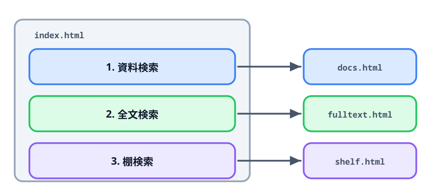
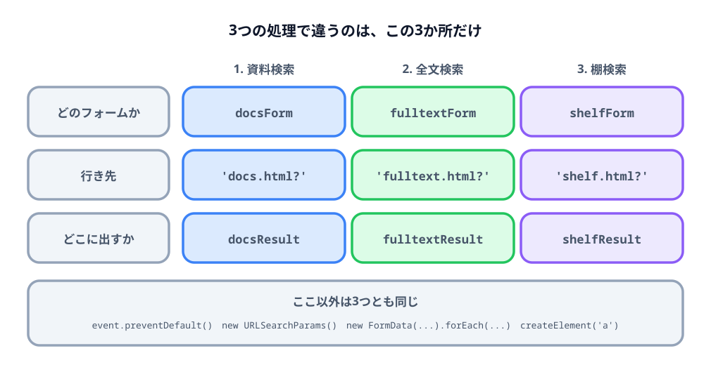

# 4-2 3つ目を足して仕上げる



最後の節です。棚検索のフォームを足して3つにし、見た目を整えて、
人に渡せる状態にします。

3つ目の足し方は2つ目とまったく同じなので、先に自分でやってみてください。

> **今回さわるファイル:** `index.html` に3つ目のフォームと `<style>` を足す

## 3つ目を足す

棚検索は、書庫・キャビネット・ドロアの番号で場所から探すものです。
行き先は `shelf.html`、パラメータは3つです。

| 項目 | パラメータ名 | 参考値 |
|---|---|---|
| 書庫 | `room` | 第2書庫 |
| キャビネット | `cabinet` | C-03 |
| ドロア | `drawer` | 2段目 |

**部署コードはありません。** 棚の場所が決まれば部署は関係ないからです。
よく似た3つのフォームですが、項目の構成からして同じではありません。

手順は前の節と同じです。やることを並べると5つです。

1. 「2. 全文検索」のかたまりをコピーして、下に貼り付ける
2. 見出しを `<h2>3. 棚検索</h2>` にする
3. `<form>` の `id` を `shelfForm`、結果の `<span>` の `id` を `shelfResult` にする
4. 表の行を `room` / `cabinet` / `drawer` の3行にし、`id` と `for` には `shelf-` を付ける
5. `<script>` の「全文検索」のかたまりをコピーして、フォーム・行き先・出力先の3か所を変える

できたら答え合わせです。HTML はこうなります。

:::code[2つ目の結果の `<p>` の下]{filepath=index.html offset=155}
```html
<h2>3. 棚検索</h2>

<form id="shelfForm">
  <table>
    <thead>
      <tr>
        <th>項目</th>
        <th>パラメータ名</th>
        <th>値</th>
        <th>参考値</th>
      </tr>
    </thead>
    <tbody>
      <tr>
        <td><label for="shelf-room">書庫</label></td>
        <td>room</td>
        <td><input id="shelf-room" name="room" required /></td>
        <td>第2書庫</td>
      </tr>
      <tr>
        <td><label for="shelf-cabinet">キャビネット</label></td>
        <td>cabinet</td>
        <td><input id="shelf-cabinet" name="cabinet" /></td>
        <td>C-03</td>
      </tr>
      <tr>
        <td><label for="shelf-drawer">ドロア</label></td>
        <td>drawer</td>
        <td><input id="shelf-drawer" name="drawer" /></td>
        <td>2段目</td>
      </tr>
    </tbody>
  </table>

  <p>
    <button type="submit">生成</button>
  </p>
</form>

<p>
  生成されたURL：<span id="shelfResult"></span>
</p>
```
:::

`required` が付くのは書庫だけです。書庫が決まらないと場所が特定できないからです。
これも3つのフォームで別々に決めています。

`<script>` はこうなります。

:::code[`<script>` の中。2つ目の `});` の下]{filepath=index.html offset=253}
```js
// 棚検索
const shelfForm = document.getElementById('shelfForm');
const shelfResult = document.getElementById('shelfResult');

shelfForm.addEventListener('submit', (event) => {
  event.preventDefault();

  const params = new URLSearchParams();

  new FormData(shelfForm).forEach((value, name) => {
    if (value !== '') {
      params.append(name, value);
    }
  });

  const url = 'shelf.html?' + params.toString();

  const link = document.createElement('a');
  link.setAttribute('href', url);
  link.setAttribute('target', '_blank');
  link.textContent = url;

  shelfResult.textContent = '';
  shelfResult.append(link);
});
```
:::

行き先の `shelf.html` も、`docs.html` と `fulltext.html` と同じフォルダに置いてください。
中身は受け取ったパラメータを並べるだけのページで、下の「完成例」から見られます。

項目が4つから3つに減っても、`forEach` の中は変わりません。
`name` が `dept` でも `room` でも、`FormData` は同じように集めます。

## 見た目を整える

動くものはできました。最後に `<style>` を足して読みやすくします。
`<style>` に書き足すだけなので、動きは何も変わりません。

まず、ページ全体と見出しです。

:::code[`<style>` の先頭]{filepath=index.html offset=6 newOffset=6}
```html
  <style>
+   body {
+     font-family: "Segoe UI", "Meiryo", sans-serif;
+     line-height: 1.7;
+     margin: 24px;
+   }
+
+   h1 {
+     font-size: 1.4em;
+     border-bottom: 2px solid #70ad47;
+     padding-bottom: 4px;
+   }
+
+   h2 {
+     font-size: 1.1em;
+     margin-top: 2em;
+   }
+
    table {
      border-collapse: collapse;
    }
```
:::

`h2` の `margin-top` は、フォームどうしの間を空けるためのものです。
3つが続けて並んでいると、どこで区切れているのかが読み取りにくくなります。

次に、入力欄・ボタン・結果欄です。

:::code[`<style>` の終わり]{filepath=index.html offset=18 newOffset=35}
```html
    th {
      background: #e2efda;
    }
+
+   input {
+     width: 14em;
+   }
+
+   button {
+     padding: 4px 16px;
+   }
+
+   .result {
+     background: #f3f3f3;
+     padding: 8px 10px;
+     word-break: break-all;
+   }
  </style>
```
:::

`input` の幅をそろえたのは、表の列の幅が行ごとに変わるのを防ぐためです。

`.result` は、`class="result"` が付いた要素に当たります。`id` と違って、
`class` は同じものを何個でも置けます。結果欄は3つあるので `class` を使います。

`word-break: break-all` は、長い URL を途中で折り返させる指定です。
これが無いと、URL が横に伸びて画面からはみ出します。

結果の `<p>` に `class` を付けます。3か所とも同じように直してください。

:::code[結果の `<p>`。3か所すべて]{filepath=index.html offset=71 newOffset=102}
```html
- <p>
+ <p class="result">
    生成されたURL：<span id="docsResult"></span>
  </p>
```
:::

これで完成です。

## 1枚のファイルとして配る

出来上がったものは4つのファイルです。

| ファイル | 役割 |
|---|---|
| `index.html` | 作ったページ |
| `docs.html` | 資料検索の受け取り側 |
| `fulltext.html` | 全文検索の受け取り側 |
| `shelf.html` | 棚検索の受け取り側 |

この4つを共有フォルダに置けば、ほかの人も開いて使えます。
インストールも設定も要りません。Edge でダブルクリックするだけです。

よく使う人には、`index.html` を Edge のお気に入りに入れてもらうか、
デスクトップにショートカットを作ってもらうと早く開けます。

:::notice
`docs.html` / `fulltext.html` / `shelf.html` は、検索システムの代わりに置いた仮のページです。
本物の検索システムに向けるときは、`<script>` の中の `'docs.html?'` の部分を
そのシステムの URL に差し替えてください。パラメータ名（`dept` など）も、
向こうが決めているものに合わせます。
:::

行き先を本物の URL に差し替えたあとは、受け取り側の3枚は要らなくなります。
配るのは `index.html` 1枚だけになります。

サクラエディタで保存するときは、文字コードを **UTF-8** にしてください。
別の文字コードで保存すると、Edge で開いたときに日本語が崩れます。

## コラム: それでもまとめたくなったら

`<script>` の中には、ほとんど同じかたまりが3つ並んでいます。
違うのは、前の節で見た3か所だけです。



3つ目を書いた時点で「またコピーした」と思ったなら、その感覚は正しいものです。
フォームが10個になれば、まとめる価値は確実に出てきます。
その場合は、違う3か所だけを並べたものを用意して、残りを1つの処理で回す形になります。

ただし、まとめるかどうかを決める材料は「似ているかどうか」ではありません。
**3つが今後も同じ向きに変わるか**です。

- 同じ向きに変わるなら、1か所直せば3つに効くので、まとめたほうが速い
- 別々に変わるなら、まとめた1か所に「資料検索のときだけ」という分岐が増えていく

この教材の3つは、後者になりやすいものです。
行き先のシステムが別々で、必須項目も違い、項目の数も違います。
全文検索に「語句が1つも無ければ止める」を足したくなったとき、
その判定は資料検索には要りません。

3つのうち2つが同じ向きに変わったことが**実際に**2〜3回あってから、
まとめる形を考えれば十分です。先にまとめておく必要はありません。

## この教材のまとめ

入力した値から検索URLを作るページが、1枚のファイルとしてできました。

やったことは、結局3つです。

1. 入力欄の値を取り出す（`id` / `name` / `FormData`）
2. キーと値を URL に組み立てる（`URLSearchParams`）
3. 押せるリンクにして画面に出す（`createElement` / `append`）

第2章では1〜3を全部自分で書き、第3章でそれをブラウザ側に渡しました。
書く量が減ったぶん、第4章ではフォームを3つ並べるのが「コピーして3か所変える」で済みました。

パラメータの数が増えても、フォームが増えても、この形のまま足していけます。
自分の案件に移すときは、行き先の URL とパラメータ名を差し替えるところから始めてください。

## 動かす

`index.html` を Edge で開いて、次の4つを確かめてください。

- フォームが3つ並び、見出しの間に余白が空いている
- 3つの「生成」が、それぞれ `docs.html?` / `fulltext.html?` / `shelf.html?` で始まる URL を作る
- 長い URL が結果欄の中で折り返して、画面からはみ出さない
- 1つの「生成」を押しても、ほかの2つの結果欄は変わらない

棚検索で書庫を空にして押すと、ブラウザの吹き出しが出ます。
`required` も3つのフォームで別々に効いています。

::preview[このステップの完成イメージ（3つの「生成」を順に押してみてください）]{height="760"}

::codeview
